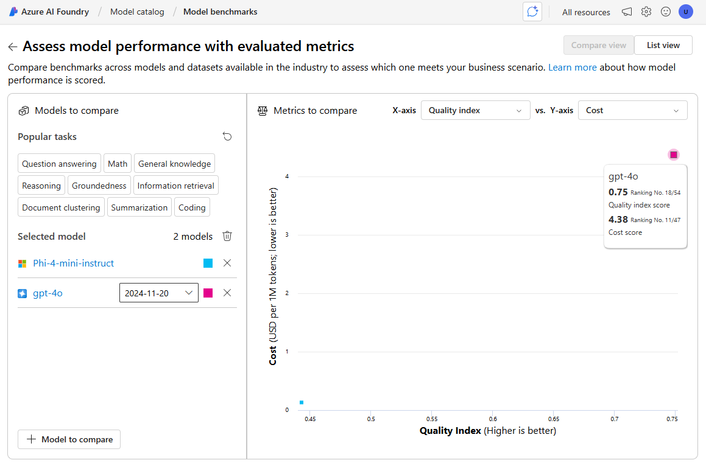

# Choose and Deploy a Language Model

The Azure AI Foundry model catalog serves as a central repository where you can explore and use a variety of models, facilitating the creation of your generative AI scenario.

In this exercise, you’ll explore the model catalog in Azure AI Foundry portal, and compare potential models for a generative AI application that assists in solving problems.

**Note:** Some of the technologies used in this exercise are in preview or in active development. You may experience some unexpected behavior, warnings, or errors.

## Explore Models

Let’s start by signing into Azure AI Foundry portal and exploring some of the available models.

1. In a web browser, open the Azure AI Foundry portal at https://ai.azure.com and sign in using your Azure credentials.
2. Close any tips or quick start panes that are opened the first time you sign in, and if necessary use the Azure AI Foundry logo at the top left to navigate to the home page, which looks similar to the following image (close the Help pane if it’s open):

    

3. Review the information on the home page.
4. In the home page, in the Explore models and capabilities section, search for the gpt-4o model; which we’ll use in our project.
5. In the search results, select the gpt-4o model to see its details.
6. Read the description and review the other information available on the Details tab.

    

7. On the gpt-4o page, view the Benchmarks tab to see how the model compares across some standard performance benchmarks with other models that are used in similar scenarios.

    

8. Use the back arrow (←) next to the gpt-4o page title to return to the model catalog.
9. Search for Phi-4-mini-instruct and view the details and benchmarks for the Phi-4-mini-instruct model.

## Compare Models

You’ve reviewed two different models, both of which could be used to implement a generative AI chat application. Now let’s compare the metrics for these two models visually.

1. Use the back arrow (←) to return to the model catalog.
2. Select Compare models. A visual chart for model comparison is displayed with a selection of common models.

    

3. In the Models to compare pane, note that you can select popular tasks, such as question answering to automatically select commonly used models for specific tasks.
4. Use the Clear all models (🗑) icon to remove all of the pre-selected models.
5. Use the + Model to compare button to add the gpt-4o model to the list. Then use the same button to add the Phi-4-mini-instruct model to the list.
6. Review the chart, which compares the models based on Quality Index (a standardized score indicating model quality) and Cost. You can see the specific values for a model by holding the mouse over the point that represents it in the chart.

    

7. In the X-axis dropdown menu, under Quality, select the following metrics and observe each resulting chart before switching to the next:
    - Accuracy
    - Quality index
8. Based on the benchmarks, the gpt-4o model looks like offering the best overall performance, but at a higher cost.
9. In the list of models to compare, select the gpt-4o model to re-open its benchmarks page.
10. In the page for the gpt-4o model page, select the Overview tab to view the model details.

## Create an Azure AI Foundry Project

To use a model, you need to create an Azure AI Foundry project.

1. At the top of the gpt-4o model overview page, select Use this model.
2. When prompted to create a project, enter a valid name for your project and expand Advanced options.
3. In the Advanced options section, specify the following settings for your project:
    - Azure AI Foundry resource: A valid name for your Azure AI Foundry resource
    - Subscription: Your Azure subscription
    - Resource group: Create or select a resource group
    - Region: Select any AI Foundry recommended*
    
    * Some Azure AI resources are constrained by regional model quotas. In the event of a quota limit being exceeded later in the exercise, there’s a possibility you may need to create another resource in a different region.

4. Select Create and wait for your project to be created. If prompted, deploy the gpt-4o model using the Global standard deployment type and customize the deployment details to set a Tokens per minute rate limit of 50K (or the maximum available if less than 50K).

    **Note:** Reducing the TPM helps avoid over-using the quota available in the subscription you are using. 50,000 TPM should be sufficient for the data used in this exercise. If your available quota is lower than this, you will be able to complete the exercise but you may experience errors if the rate limit is exceeded.

5. When your project is created, the chat playground will be opened automatically so you can test your model:

    

## Chat with the gpt-4o Model

Now that you have a model deployment, you can use the playground to test it.

1. In the chat playground, in the Setup pane, ensure that your gpt-4o model is selected and in the Give the model instructions and context field, set the system prompt to `You are an AI assistant that helps solve problems.`
2. Select Apply changes to update the system prompt.
3. In the chat window, enter the following query:

    ```
    I have a fox, a chicken, and a bag of grain that I need to take over a river in a boat. I can only take one thing at a time. If I leave the chicken and the grain unattended, the chicken will eat the grain. If I leave the fox and the chicken unattended, the fox will eat the chicken. How can I get all three things across the river without anything being eaten?
    ```

4. View the response. Then, enter the following follow-up query:

    ```
    Explain your reasoning.
    ```

## Deploy Another Model

When you created your project, the gpt-4o model you selected was automatically deployed. Let’s deploy the Phi-4-mini-instruct model you also considered.

1. In the navigation bar on the left, in the My assets section, select Models + endpoints.
2. In the Model deployments tab, in the + Deploy model drop-down list, select Deploy base model. Then search for Phi-4-mini-instruct and confirm you selection.
3. Agree to the model license.
4. Deploy a Phi-4-mini-instruct model with the following settings:
    - Deployment name: A valid name for your model deployment
    - Deployment type: Global Standard
    - Deployment details: Use the default settings
5. Wait for the deployment to complete.

## Chat with the Phi-4 Model

Now let’s chat with the new model in the playground.

1. In the navigation bar, select Playgrounds. Then select the Chat playground.
2. In the chat playground, in the Setup pane, ensure that your Phi-4-mini-instruct model is selected and in the chat box, provide the first line as System message: `You are an AI assistant that helps solve problems.` (the same system prompt you used to test the gpt-4o model, but since there is no system message setup, we’re providing it in the first chat for context.)
3. On a new line in the chat window (below your system message), enter the following query:

    ```
    I have a fox, a chicken, and a bag of grain that I need to take over a river in a boat. I can only take one thing at a time. If I leave the chicken and the grain unattended, the chicken will eat the grain. If I leave the fox and the chicken unattended, the fox will eat the chicken. How can I get all three things across the river without anything being eaten?
    ```

4. View the response. Then, enter the following follow-up query:

    ```
    Explain your reasoning.
    ```

## Perform a Further Comparison

Use the drop-down list in the Setup pane to switch between your models, testing both models with the following puzzle (the correct answer is 40!):

```
I have 53 socks in my drawer: 21 identical blue, 15 identical black and 17 identical red. The lights are out, and it is completely dark. How many socks must I take out to make 100 percent certain I have at least one pair of black socks?
```

## Reflect on the Models

You’ve compared two models, which may vary in terms of both their ability to generate appropriate responses and in their cost. In any generative scenario, you need to find a model with the right balance of suitability for the task you need it to perform and the cost of using the model for the number of requests you expect it to have to handle.

The details and benchmarks provided in the model catalog, along with the ability to visually compare models provides a useful starting point when identifying candidate models for a generative AI solution. You can then test candidate models with a variety of system and user prompts in the chat playground.

## Clean Up

If you’ve finished exploring Azure AI Foundry portal, you should delete the resources you have created in this exercise to avoid incurring unnecessary Azure costs.

1. Open the Azure portal and view the contents of the resource group where you deployed the resources used in this exercise.
2. On the toolbar, select Delete resource group.
3. Enter the resource group name and confirm that you want to delete it.