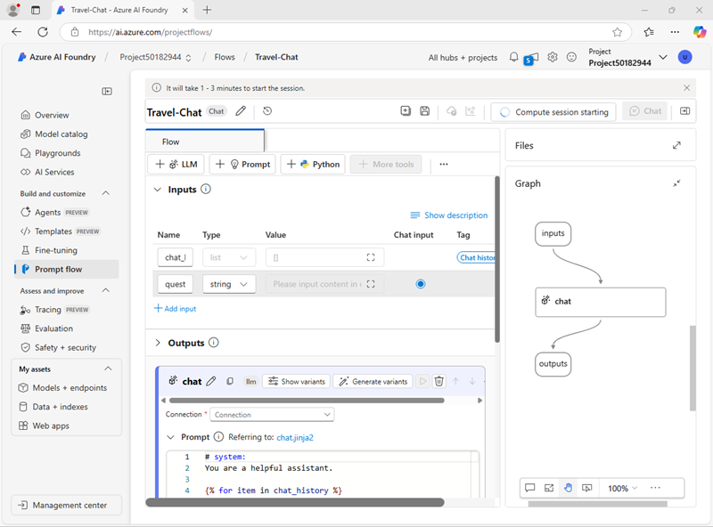

# Use a prompt flow to manage conversation in a chat app

In this exercise, use Azure AI Foundry portal’s Prompt flow to build a custom chat app that takes a user prompt and chat history as inputs, and uses a GPT model from Azure OpenAI to generate an output.

- Note: Some features are in preview and may show unexpected behavior, warnings, or errors.

## Create an Azure AI Foundry hub and project

1) In a browser, open https://ai.azure.com and sign in with your Azure credentials. Close any tips or quick start panes if shown, and use the Azure AI Foundry logo to return to the home page if needed.
    - 

2) Navigate to https://ai.azure.com/managementCenter/allResources, select Create new, then choose to create a new AI hub resource.

3) In the Create a project wizard:
    - Enter a valid project name.
    - Select the option to create a new hub, and use Rename hub to specify a valid unique name.
    - Expand Advanced options and set:
      - Subscription: Your Azure subscription
      - Resource group: Create or select a group
      - Region: East US 2 or Sweden Central
    - Note: If subscription policies restrict names, use the link to create the hub in the Azure portal.

    - Tip: If Create is disabled, ensure the hub name is unique and alphanumeric.

4) Wait for the project to be created.

## Configure resource authorization

Ensure the Azure AI Foundry resource can read prompt flow assets in blob storage.

1) Open https://portal.azure.com in a new tab. Go to the resource group containing your AI hub resources.

2) Open the Azure AI Foundry resource for your hub. Under Resource Management, select Identity.
    - 

3) If System assigned identity is Off, switch it On and save. Wait for status to confirm.

4) Return to the resource group. Open the Storage account for your hub and go to Access control (IAM).
    - 

5) Add a role assignment:
    - Role: Storage Blob Data Reader
    - Assign to: The managed identity of your Azure AI Foundry project resource
    - 

6) Close the Azure portal tab and return to Azure AI Foundry.

## Deploy a generative AI model

1) In your project, go to My assets > Models + endpoints.

2) On Model deployments, select + Deploy model > Deploy base model.

3) Search for and select gpt-4o.

4) Choose Customize and set:
    - Deployment name: Valid unique name
    - Deployment type: Global Standard
    - Automatic version update: Enabled
    - Model version: Latest available
    - Connected AI resource: Your Azure OpenAI connection
    - Tokens per Minute Rate Limit (thousands): 50K (or your max)
    - Content filter: DefaultV2

    - Note: Lower TPM helps prevent quota overuse; if your quota is lower, you can continue but may hit rate limits.

5) Wait for deployment to complete.

## Create a prompt flow

1) In the left navigation, under Build and customize, select Prompt flow.

2) Create a new flow using the Chat flow template, with folder name Travel-Chat.
    - Tip: If permissions errors occur, wait a few minutes and try again with a different name.

3) Start compute: select Start compute session.

4) Explore the flow:
    - Inputs: chat history, user question
    - Outputs: model answer
    - Chat LLM tool: configuration and prompt
    - 

5) In the Chat LLM tool:
    - Connection: Select your Azure OpenAI connection
    - Connection properties:
      - Api: chat
      - deployment_name: The gpt-4o deployment you created
      - response_format: {"type":"text"}

6) In Prompt, replace the text with:

```
# system:
**Objective**: Assist users with travel-related inquiries, offering tips, advice, and recommendations as a knowledgeable travel agent.

**Capabilities**:
- Provide up-to-date travel information, including destinations, accommodations, transportation, and local attractions.
- Offer personalized travel suggestions based on user preferences, budget, and travel dates.
- Share tips on packing, safety, and navigating travel disruptions.
- Help with itinerary planning, including optimal routes and must-see landmarks.
- Answer common travel questions and provide solutions to potential travel issues.

**Instructions**:
1. Engage with the user in a friendly and professional manner, as a travel agent would.
2. Use available resources to provide accurate and relevant travel information.
3. Tailor responses to the user's specific travel needs and interests.
4. Ensure recommendations are practical and consider the user's safety and comfort.
5. Encourage the user to ask follow-up questions for further assistance.

# user:
```

7) Inputs to the Chat LLM tool:
    - question (string): ${inputs.question}
    - chat_history (string): ${inputs.chat_history}

8) Save the flow.
    - Note: The editor includes many tools you can add to orchestrate more complex conversations.

## Test the flow

1) Ensure the compute session is running.

2) Select Chat to open the Chat pane and wait for initialization.

3) Enter: I have one day in London, what should I do? Review the output.
    - 

## Deploy the flow

- Note: Deployment can take a long time and may be impacted by capacity constraints.

1) Select Deploy and configure:
    - Basic:
      - Endpoint: New
      - Endpoint name: Unique name
      - Deployment name: Unique name
      - Virtual machine: Standard_DS3_v2
      - Instance count: 1
      - Inferencing data collection: Disabled
    - Advanced: Use defaults

2) In Azure AI Foundry, go to My assets > Models + endpoints.
    - If you see only model deployments, wait for the flow deployment to appear and complete.

3) After success, open the deployment and go to Test.
    - Tip: If shown as unhealthy, wait a minute and refresh.

4) Test prompts:
    - What is there to do in San Francisco?
    - Tell me something about the history of the city.
    - 

5) View the Consume page for connection details and sample client code to integrate the endpoint into applications.

## Clean up

1) Go to https://portal.azure.com.

2) Home > Resource groups.

3) Select the resource group used for this exercise.

4) Select Delete resource group, enter the name to confirm, and delete.